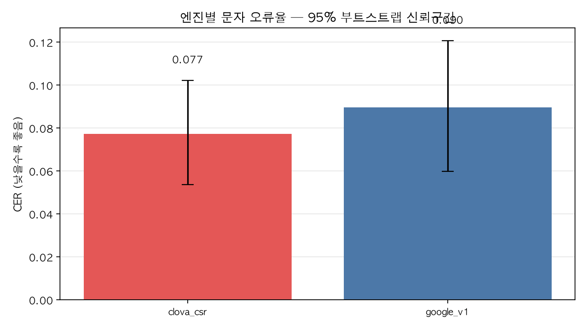
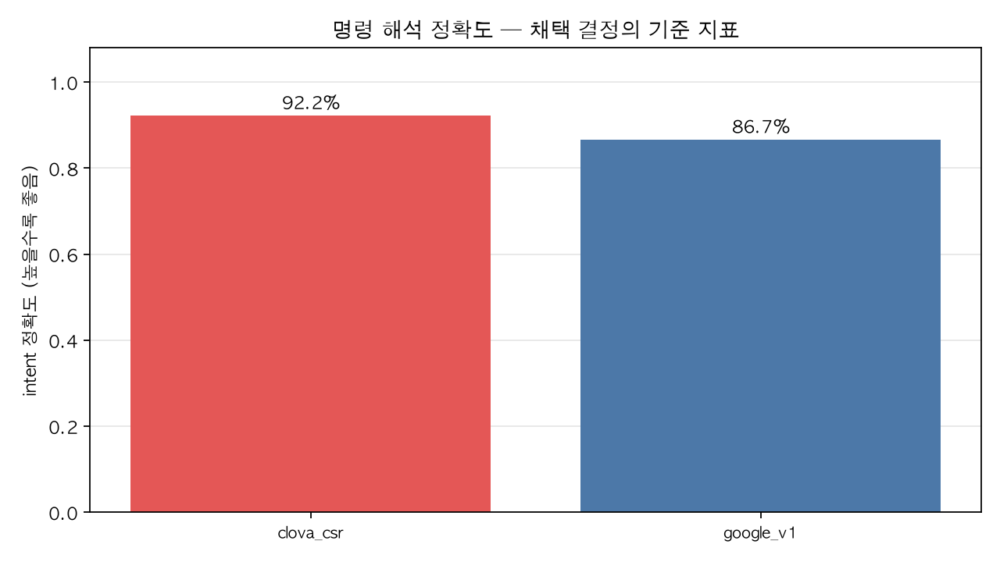
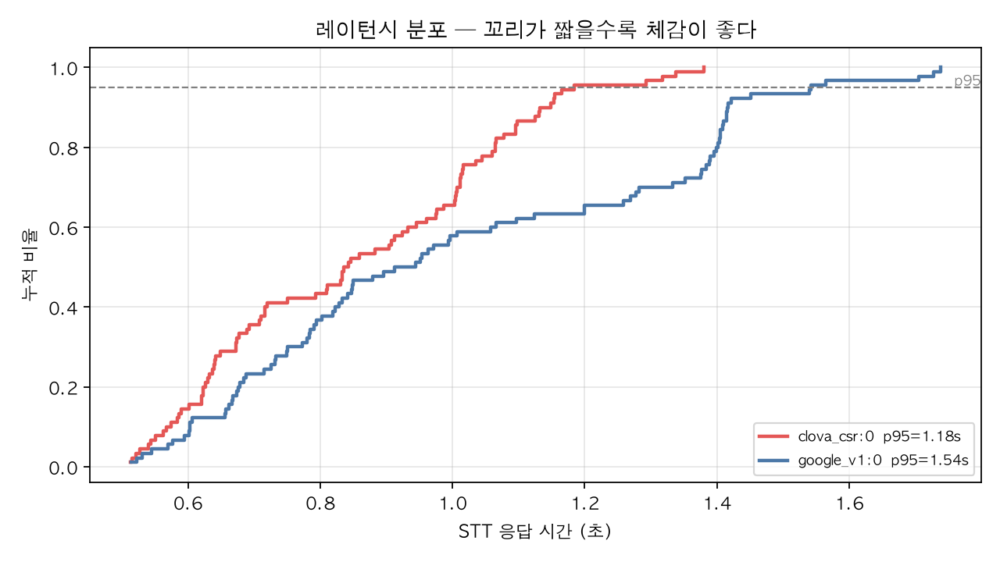
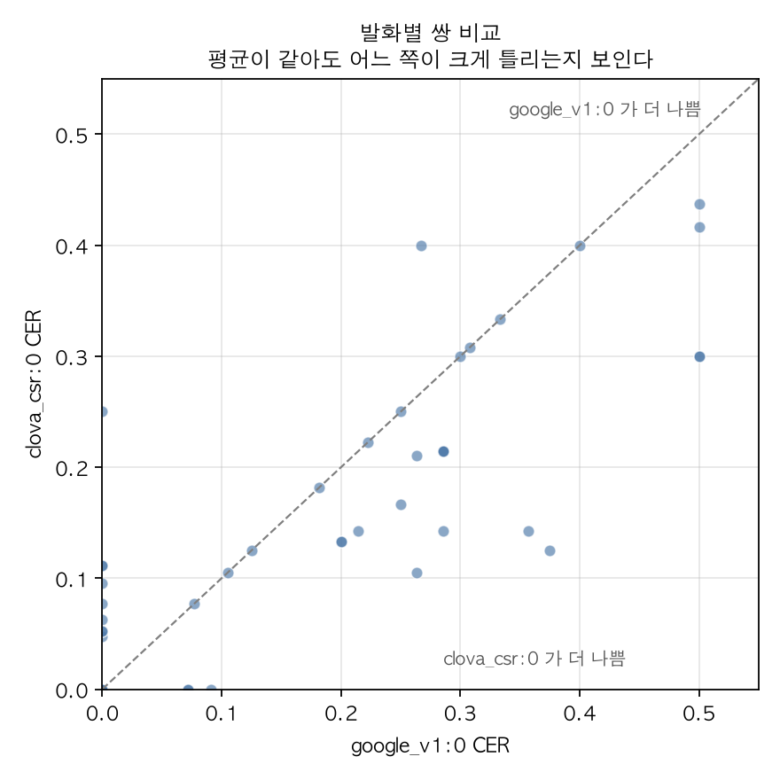
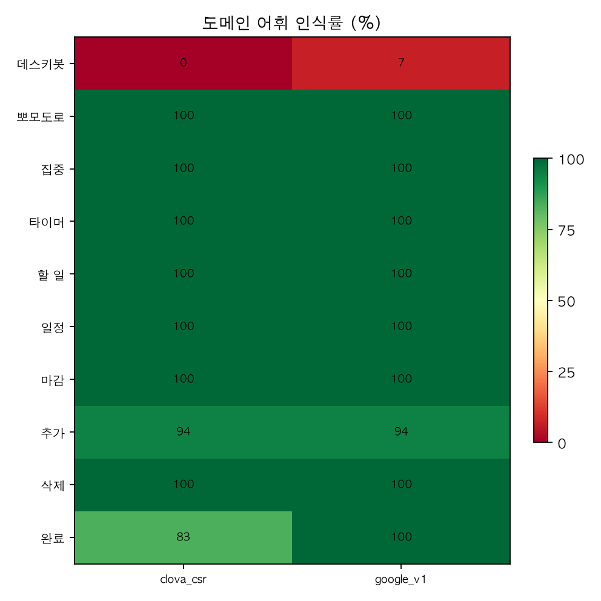

# 한국어 STT 엔진 비교 검증 보고서

> 작성일 2026-08-19 / 측정 위치: EC2(deskibot-osaka)

## 1. 배경과 목적

Deskibot 음성 파이프라인은 `ESP32 → STT → Claude(Tool Use) → TTS → ESP32`로
동작하며, STT는 현재 Google Cloud Speech v1을 쓴다 (`server/server.py`의
`run_stt()`). 입력이 전부 한국어 단문 명령이므로, 한국어에 특화된 CLOVA STT가
더 나은지 검증하고 채택 여부를 결정한다.

**현행 구성**: Google Cloud Speech v1 batch `recognize`, LINEAR16 16 kHz mono,
`ko-KR`, `enable_automatic_punctuation=True`,
도메인 어휘 12개에 `phrase hints` + `boost 15.0`.

**비교 대상은 힌트를 끈 두 구성뿐이다** — `google_v1:0` vs `clova_csr:0`.
CLOVA CSR에는 부스팅 기능 자체가 없어서, 튜닝된 Google과 비교하면 엔진 성능이
아니라 "튜닝을 했는가"를 재게 된다. 엔진 자체의 한국어 성능을 가리는 것이
목적이므로 맨몸 대 맨몸으로 잰다.

## 2. 평가 지표

최종 실패는 "글자가 틀린 것"이 아니라 "명령이 잘못 해석된 것"이므로 2층 구조로 잰다.

| 층 | 지표 | 정의 |
|---|---|---|
| 1차 | CER (주지표) | 정규화 후 공백 제거 문자 오류율 |
| 1차 | WER (보조) | 어절 오류율. 한국어 띄어쓰기에 과민해 보조로만 |
| 1차 | 빈 결과율 | 전사가 빈 문자열로 오는 비율 |
| 2차 | **intent 정확도** | 도구명 일치 + 핵심 인자 일치 (**결정 근거**) |
| 운영 | 레이턴시 p50/p95 | EC2에서 3회 측정 중앙값 |
| 도메인 | 어휘 인식률 | 고유명사 12개가 전사에 살아남은 비율 |

### 정규화 규칙

엔진마다 표기 습관이 달라, 정규화 없이는 성능이 아니라 표기 차이를 재게 된다
(Google은 `enable_automatic_punctuation=True`라 마침표가 붙고, CLOVA는 띄어쓰기를
덜 넣는다). `normalize.py`에 고정한 규칙:

- NFC 정규화, 소문자화
- 문장부호 제거 (`. , ! ? ~ … · " ' ` - — ( ) [ ] { } : ; /`)
- 한국어 수사 → 아라비아 숫자, **단위(시·분·초·개·시간) 앞에서만**
  ("세 시" → "3시"). "세탁"·"한글" 같은 무관한 단어를 건드리지 않기 위한 제한이다
- CER은 공백 제거 후, WER은 공백 유지하고 어절 단위로 계산

검증 예: `"데스키봇, 오후 세 시까지 영어 숙제 있어."` 와
`"데스키봇 오후 3시까지 영어숙제 있어"` → 정규화 후 완전 일치(CER 0.000).
같은 쌍의 WER은 0.75로, 한국어에서 WER이 표기 차이에 과민함을 보여준다.

## 3. 데이터셋

- 발화 30종 × 조건 3 = **90 녹음**, 완전 짝지음 설계
- 조건: c1 조용/30cm · c2 생활소음/30cm · c3 조용/100cm
- 단일 요청 20종: 조회 4 / 추가 7 / 완료 4 / 삭제 3 / 기기명령(none) 2
- **복합 요청 10종**: 한 문장에 도구를 두 번 부르는 발화
  (추가×2, 삭제×2, 완료×2, 조회+추가, 조회+삭제, 완료+추가, 그리고
  2요청처럼 들리지만 도구는 하나면 충분한 오탐 검증 1종)
- 화자 1명, 녹음 기기: **ESP32 실기기** (`DEBUG_DUMP_AUDIO=1`+`DUMP_ONLY=1`로 수신 PCM 덤프)

실기기 녹음을 쓴 이유: 노트북 마이크로는 마이크 특성·거리·게인이 빠져
현장 성능과 무관한 숫자가 나온다.

## 4. 실험 설계와 통제

| 통제 항목 | 처리 |
|---|---|
| 오디오 | 같은 wav를 두 엔진에 그대로 전달 |
| 힌트 | 양쪽 다 끔 (`--no-hints`) — CSR에 부스팅이 없어 맨몸끼리 비교 |
| 측정 위치 | EC2 (운영과 동일 호스트) |
| LLM 조건 | 카테고리 목록·기준 시각 상수 고정 |
| DB | intent 채점은 도구를 실행하지 않는 읽기 전용 경로 |
| 레이턴시 | 3회 측정 중앙값 (네트워크 변동 흡수) |

### 알려진 한계 (해석에 반드시 반영)

**1. c3의 트리밍 손실.** 기기의 무음 제거 문턱이
`max(TRIM_ABS_FLOOR=600, peak/12)`인데(`voice.h:485`), 1 m 거리에서는 발화 피크가
830~1,500까지 떨어져 600이 항상 이긴다. 조용한 끝음절이 문턱 아래로 내려가
잘려 나갔다(u24-c3 끝 진폭 310, u26-c3 490). 같은 문장의 c1 녹음은 피크 4,650으로
멀쩡하다. **두 엔진에 같은 wav가 들어가므로 비교 공정성은 유지되지만**, c3 수치는
"1 m의 순수 효과"가 아니라 **"1 m + 트리밍 손실"** 이다.

**2. 화자 1명.** 화자별 편차는 이 실험으로 알 수 없다.

**3. 힌트 효과 미측정.** 부스팅을 켠 구성은 이번 비교 범위 밖이다.
다만 예비 관찰에서 부스트가 호출어를 살리는 대신 내용어를 잡아먹는 사례가
있었다(6절 참고).

## 5. 결과

### 5.1 요약

| 구성 | n | CER | WER | 빈 결과 | intent | p50 | p95 |
|---|---|---|---|---|---|---|---|
| **clova_csr** | 90 | **0.077** | **0.333** | 0.0% | **92.2%** | **0.84s** | **1.18s** |
| google_v1 (힌트 없음) | 90 | 0.090 | 0.493 | 0.0% | 86.7% | 0.93s | 1.54s |

모든 지표에서 CLOVA가 앞선다. 다만 아래 5.7에서 보듯 **정확도 차이는 통계적으로
유의하지 않고, 레이턴시 차이만 유의하다.**

빈 결과율은 양쪽 다 0%로, 탈락 조건(5% 초과)에 걸리는 엔진은 없다.

### 5.2 문자 오류율



세 조건 모두 CLOVA가 낮다. 조용(30cm)에서 0.044 vs 0.057, 소음에서 0.057 vs 0.077로
격차가 유지되다가, 1 m에서는 0.131 vs 0.135로 거의 붙는다. 원거리에서는 두 엔진이
공통으로 무너진다 — 다만 이 구간은 기기 트리밍 손실이 섞여 있다(4절).

### 5.3 명령 해석 정확도 — 결정 근거



### 5.4 레이턴시



### 5.5 발화별 쌍 비교



대각선 위쪽(CLOVA가 더 나쁨)에 몰린 점들은 대부분 CLOVA가 단어를 통째로 누락한
경우고, 아래쪽(Google이 더 나쁨)은 호출어가 들어간 발화다. 평균 차이는 작지만
**실패 원인이 서로 다른 발화 집합에 몰려 있다**(6.2 참고).

### 5.6 도메인 어휘



핵심은 "데스키봇" 행이다 — 힌트 없이는 **두 엔진 모두 사실상 0%** 다
(Google 1/15, CLOVA 0/15). 나머지 도메인 어휘(할 일·일정·마감·추가·삭제·완료 등)는
양쪽 다 무리 없이 인식한다. 즉 도메인 어휘 문제는 **고유명사 하나에 집중**돼 있고,
그것을 보정할 수단(phrase hints)은 Google에만 있다.

### 5.7 유의성 검정

| 지표 | 차이 (Google − CLOVA) | 95% CI | 판정 |
|---|---|---|---|
| CER | +0.0123 | [−0.0020, +0.0267] | **유의차 없음** (CI가 0 포함) |
| intent | — | McNemar p = 0.180 (2 vs 7) | **유의차 없음** |
| 레이턴시 | +0.160s | [+0.127, +0.192] | **유의함** (CLOVA가 빠름) |

정확도(CER·intent)는 CLOVA가 앞서지만 **90발화로는 우연을 배제할 수 없다.**
반면 레이턴시 차이는 명확하다.

| 조건 | clova_csr CER | google_v1 CER | 우세 |
|---|---|---|---|
| c1 조용 30cm | **0.0444** | 0.0573 | CLOVA |
| c2 소음 30cm | **0.0569** | 0.0771 | CLOVA |
| c3 조용 1m | **0.1308** | 0.1346 | 거의 동률 |

| 조건 | clova_csr intent | google_v1 intent |
|---|---|---|
| c1 조용 30cm | **97%** (29/30) | 93% (28/30) |
| c2 소음 30cm | **97%** (29/30) | 87% (26/30) |
| c3 조용 1m | **83%** (25/30) | 80% (24/30) |

**발화 유형별로 갈린다 — 이게 가장 뚜렷한 차이다.**

| 유형 | n | clova_csr | google_v1 | 불일치 쌍 | McNemar p |
|---|---|---|---|---|---|
| 단일 요청 | 60 | 93% (56/60) | 93% (56/60) | 2 : 2 | 1.000 |
| **복합 요청** | 30 | **90%** (27/30) | **73%** (22/30) | **0 : 5** | **0.0625** |

단일 요청은 완전히 같고, 한 문장에 두 요청을 담은 복합 발화에서만 17%p 벌어진다.

**이 p값은 해석에 주의가 필요하다.** 복합 요청의 불일치 쌍 5건이 **전부 한 방향**
(CLOVA만 정답)인데도 p=0.0625로 관례적 기준(0.05)을 넘지 못한다. 이는 차이가
없어서가 아니라 **표본이 작아 증명이 불가능하기 때문**이다. 불일치 쌍이 5건일 때
McNemar 정확검정이 낼 수 있는 최솟값이 `2 x 0.5^5 = 0.0625`다. 즉 이보다 더
완벽한 결과는 존재할 수 없다. 복합 발화를 **1건만 더** 측정해 같은 방향이
나오면(불일치 6건 전부 한쪽) p=0.031로 유의해진다.

**그리고 복합 요청의 CER은 사실상 동일하다** (차이 -0.0002, CI [-0.018, +0.018]).
전사 품질은 같은데 intent만 갈린다 - *얼마나 정확히 받아쓰느냐*가 아니라
*어떤 단어를 놓치느냐*의 문제이고, 두 번째 요청을 통째로 잃는 쪽이 Google이었다.
이 시스템에서 CER이 결정 지표가 될 수 없다는 것을 보여주는 사례이기도 하다.

> 다만 이는 **사후 부분집합 분석**이다. 사전에 정한 판정 기준은 전체 90건의
> intent 정확도였고, 거기서는 유의차가 없었다(p=0.180). 복합 발화 결과는
> 채택을 뒷받침하는 정황이지 사전 등록된 근거는 아니다.

## 6. 오류 유형 분석

### 6.1 호출어 "데스키봇" — 두 엔진 모두 실패

호출어가 들어간 15발화에서 정확히 인식한 건수:

| 엔진 | 인식 |
|---|---|
| google_v1 (힌트 없음) | **1 / 15** |
| clova_csr | **0 / 15** |

실측 오인식: `테스트 키보드`, `SK 본`, `베스킨`, `테스 키보드`(Google) /
`데 스키보드`, `베 스킵`(CLOVA).

CLOVA는 한 번도 정확히 맞히지 못했지만 **일관되게 `데 스키보드`로 근접**한 반면,
Google은 `SK 본`·`베스킨`처럼 원형을 잃고 주변 단어까지 삼켰다.

> **이 항목이 채택 판단에 직접 영향을 준다.** Google은 phrase hints로 호출어를
> 살릴 수 있다(예비 검증에서 확인). **CLOVA CSR에는 부스팅 기능이 아예 없다.**
> 즉 맨몸 성능에서 CLOVA가 앞서도, 튜닝 여지는 Google에만 있다.

### 6.2 실패 방식이 서로 다르다

**CLOVA — 단어를 통째로 빠뜨린다**

| 발화 | 정답 | CLOVA 출력 |
|---|---|---|
| u16-c3 | 치과 예약 삭제해줘 | `예약 삭제해줘` (치과 누락) |
| u29-c3 | 영어 숙제 완료하고 **내일** 발표 준비 추가해줘 | `영어숙제 완료하고 발표준비 추가해줘` |

**Google — 호출어 구간이 붕괴하며 인접 단어까지 잃는다**

| 발화 | 정답 | Google 출력 |
|---|---|---|
| u18-c2 | 데스키봇 **회로** 실습 준비 취소해줘 | `베스킨 실습 준비 취소 해 줘` |
| u02-c2 | 데스키봇 오늘 뭐 해야 해 | `SK 본 오늘 뭐 해야 돼?` |

누락은 intent 슬롯을 깨뜨릴 수 있어 CER보다 위험하다. 그럼에도 intent 정확도는
CLOVA가 높았는데, LLM이 남은 문맥으로 의도를 복원하는 경우가 많기 때문이다.

### 6.3 복합 발화에서 격차가 벌어진다

단일 요청은 93% 대 93%로 동률인데, 복합 요청에서만 90% 대 73%로 갈린다.
문장이 길어질수록 Google의 인식 손실이 두 번째 요청을 통째로 날리는 빈도가 높다.

### 6.4 힌트의 부작용 (참고 — 본 실험 밖)

예비 검증에서 힌트를 켠 Google이 `데스키봇 오늘 뭐 해야 해`를
`데스키봇 뭐 해야 돼?`로 인식해 **"오늘"이 사라졌다.** 힌트를 끈 Google과 CLOVA는
둘 다 "오늘"을 들었다. 부스트가 호출어를 살리는 대신 내용어를 잡아먹은 사례로,
힌트 도입 시 별도 검증이 필요하다는 근거가 된다(`server.py:72` 주석의 우려가 실측됨).

## 7. 비용

공개 요금표 기준(2026-08-19 확인).

| | 과금 단위 | 무료 구간 | 단가 |
|---|---|---|---|
| Google STT v1 | **1초 올림** | 계정당 **월 60분** | $0.024/분 (데이터 로깅 미동의)<br>$0.016/분 (동의 시) |
| CLOVA CSR | **15초 올림** | 없음 | **15초당 4원** (VAT 별도)<br>호출당 최대 60초 |

**단가보다 과금 단위가 결정적이다.** 실측 90발화의 평균 길이는 4.78초(중앙값 4.20초)로,
CLOVA는 거의 모든 호출이 15초로 올림된다.

| | 90건 기준 과금 대상량 |
|---|---|
| Google (1초 올림) | 481초 |
| CLOVA (15초 올림) | **1,350초 — 2.81배** |

Google 무료 한도 60분은 이 발화 길이로 **월 673회**에 해당한다.

| 사용량 | Google | CLOVA (VAT 별도) | 차액 |
|---|---|---|---|
| 하루 20회 (월 600) | **0원** | 2,400원 | +2,400원 |
| 하루 100회 (월 3,000) | 6,714원 | 12,000원 | +5,286원 |
| 하루 500회 (월 15,000) | 41,346원 | 60,000원 | +18,654원 |

**모든 구간에서 Google이 저렴하다.** 15초당 4원은 손익분기(하루 100회 기준
2.24원)를 넘고, 하루 20회 구간에서는 Google이 무료라 비교 자체가 성립하지 않는다.

다만 **절대 금액은 작다.** 1인 1로봇에 하루 20회면 월 2,400원(VAT 포함 2,640원)이다.
비율로는 1.8배지만 금액으로는 커피 한 잔 수준이라, 지연 단축이라는 목표와
맞바꿀 만하다고 판단했다.

계산 재현: `python3 bench/cost.py --calls-per-day 20 --clova-per-15s 4.0`

## 8. 결론

판단이 뒤섞이지 않도록 **성능 / 단가 / 종합** 세 갈래로 나눠 적는다.
사용량이나 요금이 바뀌었을 때 어느 결론이 뒤집히는지 바로 보이게 하기 위함이다.

### 8.1 성능만 봤을 때

비용을 전혀 고려하지 않고 인식 품질만 비교한 결과다.

| 관점 | 우세 | 근거 |
|---|---|---|
| CER (전체) | CLOVA | 0.077 vs 0.090 — **유의차 없음** (CI [−0.002, +0.027]) |
| intent 정확도 | CLOVA | 92.2% vs 86.7% — **유의차 없음** (McNemar p=0.180) |
| 조용 (c1) | CLOVA | intent 97% vs 93% |
| 소음 (c2) | CLOVA | intent 97% vs 87% — 격차 최대 |
| 원거리 (c3) | 동률 | CER 0.131 vs 0.135, intent 83% vs 80% |
| **복합 발화** | **CLOVA** | **90% vs 73%** — 불일치 5건이 전부 CLOVA 쪽 (p=0.0625, 이 표본의 최솟값) |
| 단일 발화 | 동률 | 93% vs 93% |
| 호출어 "데스키봇" | 둘 다 실패 | 0/15 vs 1/15 — **단, 튜닝 여지는 Google에만** |
| 레이턴시 p95 | CLOVA | 1.18s vs 1.54s — **유의함** (CI [+0.127, +0.192]) |
| 빈 결과율 | 동률 | 양쪽 0% |

**성능 결론: CLOVA 우세.** 모든 지표에서 앞서고 뒤지는 항목이 없다.
다만 **통계적으로 확실한 우위는 레이턴시뿐**이고, 정확도 우위는 90발화로는
우연을 배제하지 못한다. 실질적 차이는 **복합 발화(17%p)** 와 **소음 환경(10%p)** 에
집중돼 있다.

단 하나의 반대 근거: 호출어 튜닝이 Google에서만 가능하다. 현행 운영 구성은
힌트를 켠 Google이므로, 이 비교(힌트 끔)는 **실제 운영 중인 Google보다 불리한
조건**에서 잰 것이다.

### 8.2 단가만 봤을 때

성능을 전혀 고려하지 않고 요금만 비교한 결과다.
단가보다 **과금 구조**가 먼저다. 이 제품의 발화는 평균 4.78초인데,

| | 과금 단위 | 무료 구간 | 90건 기준 과금량 |
|---|---|---|---|
| Google STT v1 | 1초 올림 | 월 60분 | 481초 |
| CLOVA CSR | **15초 올림** | 없음 | **1,350초 (2.81배)** |

짧은 음성 명령이라 CLOVA는 거의 모든 호출이 15초로 올림된다.
Google 무료 한도 60분은 이 발화 길이로 **월 673회**에 해당한다.

| 사용량 | Google | CLOVA (15초당 4원) | 우세 |
|---|---|---|---|
| 하루 20회 (월 600) | **0원** (무료 한도 내) | 2,400원 | Google |
| 하루 100회 (월 3,000) | 6,714원 | 12,000원 | Google |
| 하루 500회 (월 15,000) | 41,346원 | 60,000원 | Google |

손익분기는 하루 100회 기준 15초당 2.24원, 500회 기준 2.76원이었다.
실단가 4원은 그보다 비싸다.

**단가 결론: Google 우세 (모든 구간).** 근거는 단가만이 아니라 **과금 구조**다.
1) Google은 월 60분 무료 = 이 발화 길이로 **월 673회**. 1인 1로봇에서 하루 20회면
   완전 무료다. CLOVA는 무료 구간이 없다.
2) 평균 4.78초 발화에 CLOVA는 15초 올림 과금 — 실사용의 약 3배를 낸다.
   짧은 음성 명령 제품에 불리한 과금 단위다.

> 1인 1로봇 제품에서 하루 20회 수준이면 Google은 무료 한도 안에 들어가고
> CLOVA는 무료 구간이 없다. 이 구간에서는 **CLOVA 단가가 얼마든 Google이 저렴하다.**

### 8.3 둘 다 고려했을 때 (채택안)

판정 기준(README 6절, 측정 전 확정)을 순서대로 적용한다.

1. intent 정확도 유의차: **없음** (McNemar p=0.180) → 다음 단계로
2. p95 레이턴시: **CLOVA가 유의하게 빠름** (−0.16s, CI [+0.127, +0.192])
3. 빈 결과율 5% 탈락: 양쪽 0% — 해당 없음

**기준에 따른 결론: clova_csr 채택.**

### 8.4 최종 결정 (2026-08-19)

**채택: CLOVA CSR.** 서버에 반영 완료.

결정 과정을 그대로 남긴다.

| 시점 | 판단 | 근거 |
|---|---|---|
| 측정 직후 | 사전 규칙 → CLOVA | 레이턴시만 유의차 |
| 1차 권고 | 현행 Google 유지 | 정확도 우위 미확인 + 비용 우위 + 튜닝 여지 |
| **최종** | **CLOVA 채택** | **팀의 최우선 목표가 지연 단축임이 확정됨** |

1차 권고에서 Google 유지를 제안한 이유는 정확도 차이가 통계적으로 확인되지 않았고,
비용은 Google이 무료 구간이며, 호출어 보정 수단이 Google에만 있기 때문이었다.
그러나 **제품의 최우선 목표가 지연 단축**이라는 점이 명확해지면서, 유일하게
유의한 차이가 난 지표(레이턴시)를 우선하는 것이 맞다고 판단했다.
이는 측정 전에 확정한 판정 기준과도 일치한다.

**받아들인 대가**

- **비용**: 모든 사용량 구간에서 Google이 저렴하다. 하루 20회 기준 Google 0원
  vs CLOVA 월 2,400원(VAT 별도). 다만 절대 금액이 작아 결정을 뒤집을 수준은
  아니라고 판단했다. 사용량이 크게 늘면(하루 500회 → 월 1.9만원 차이) 재검토한다.
- **튜닝 여지 상실**: CLOVA CSR에는 키워드 부스팅이 없다. 호출어 "데스키봇"을
  Google의 phrase hints로 보정하던 수단이 사라진다. 맨몸 비교에서는 두 엔진 다
  못 알아들었으므로(1/15 vs 0/15) 당장의 손해는 아니지만, 개선 여지가 닫힌다.
- **지연 개선폭은 작다**: STT 0.16초는 전체 왕복(약 9~11초)의 2%에 못 미친다.
  실제 지연 개선은 별도 작업에서 얻었다(`report_latency.md`).

**얻은 것**

- 레이턴시 p95 1.54s -> 1.18s (유의함)
- **복합 발화 intent 73% -> 90%** — 불일치 쌍 5건이 전부 CLOVA 쪽이다. p=0.0625로
  관례 기준은 못 넘지만 이 표본 크기에서 나올 수 있는 가장 강한 결과다.
  실패 건수로는 8건 -> 3건. 실사용 체감에 직결되는 차이다.
- 소음 환경 intent 87% -> 97%

**롤백 방법**

엔진은 환경변수로 고른다. 코드 변경·재배포 없이 되돌릴 수 있다.

```bash
# EC2의 .env에 추가 후 서비스 재시작
STT_ENGINE=google
```

기본값은 `clova`. 한쪽 엔진이 실패하면 자동으로 다른 쪽을 한 번 시도하므로,
장애 시에도 음성 기능 전체가 멈추지는 않는다.

**재검토 조건**

- 사용량이 하루 수백 회 규모로 늘면 비용 차액이 월 1만원을 넘는다. 그때 재검토
- 호출어 인식이 실사용에서 문제가 되면, 부스팅이 있는 CLOVA Speech(장문 API)
  구독 또는 Google 복귀를 검토한다
- 화자를 늘려 재측정했을 때 정확도 차이가 뒤집히면 재검토
- **복합 발화를 10건 더 측정하면** 현재 0:5인 불일치 쌍의 방향성이 유의성에
  도달하는지 확인할 수 있다. 채택을 뒤집기 위해서가 아니라 근거를 사전 등록된
  수준으로 끌어올리기 위한 후속 측정이다.

### 8.5 이 결론의 한계

- 화자 1명, 90발화. 정확도 차이의 유의성을 가리기에 표본이 작다.
- c3(1 m)는 기기 트리밍 손실이 섞여 있어 순수 거리 효과가 아니다(4절 참고).
- 힌트를 켠 Google(현행 운영 구성)과는 비교하지 않았다. 맨몸 대 맨몸 비교다.

## 9. 적용 시 영향 범위

교체할 경우 건드리는 곳은 `server/server.py`의 `run_stt()` 하나다.
반환 타입(`str`)과 호출부가 그대로라 파이프라인 나머지는 무변경이다.

- 추가 의존성: `requests` (CLOVA는 REST 호출)
- 자격증명: `.env`에 `NAVER_API_KEY`, `NAVER_CLIENT_ID` (이미 설정됨)
- 롤백: `run_stt()`를 되돌리고 재배포. 스키마·펌웨어 변경 없음
- 잔여 리스크
  - CLOVA는 호출당 60초 제한 — 현재 최대 발화 9.3초라 여유 있음
  - 부스팅 불가 — 호출어 오인식을 튜닝으로 보정할 수단이 없다
  - 장애 시 폴백 전략 미수립 (양쪽 다 해당)

## 10. 부수 발견 (STT 결론과 별개)

**기기 트리밍이 원거리 발화의 말끝을 자른다.** `voice.h:485`의 무음 제거 문턱이
`max(TRIM_ABS_FLOOR=600, peak/12)`인데, 1 m 거리에서 발화 피크가 830~1,500까지
떨어지면 600이 항상 이겨 조용한 끝음절이 잘려 나간다(u24-c3 끝 진폭 310,
u26-c3 490). 벤치 공정성에는 영향이 없지만(같은 wav를 두 엔진에 전달),
**실사용에서 사용자가 멀리서 말하면 말끝이 사라진다.**
문턱을 절대값이 아니라 피크 비례로 바꾸는 것이 맞다. 별도 이슈로 처리 권장.

## 11. 재현 방법

```bash
venv/bin/pip install -r bench/requirements.txt
venv/bin/python bench/run_bench.py --engines google_v1,clova_csr --no-hints --repeat 3
venv/bin/python bench/intent.py
venv/bin/python bench/score.py --baseline google_v1:0 --challenger clova_csr:0
venv/bin/python bench/plot.py --baseline google_v1:0 --challenger clova_csr:0
```

전사·레이턴시는 EC2에서 측정(운영과 동일 위치), 그래프는 한글 폰트가 있는
로컬에서 생성했다. 원자료는 `results/transcripts.jsonl`, `results/intents.jsonl`.
